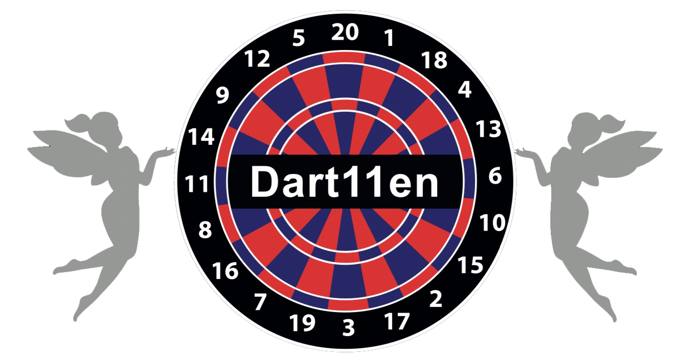

<!DOCTYPE html>  
<html lang="de">  
<head>  
  <meta charset="UTF-8">  
  <title>Dannis Treff Dart Turnier</title>  
  <link rel="stylesheet" href="style.css">  
</head>  
<body>  
  
<header class="navbar">  
    
  
          
        Dannis Treff  
    
  
  
    <nav class="menu">  
        <a href="#">Turniere</a>  
        <a href="#">Regeln</a>  
        <a href="#">Kontakt</a>  
    </nav>  
</header>  
  
<main class="hero">  
  
  <section class="info">  
    
DART TURNIER
  
    <h1>DANNIS TREFF Turnier 2026</h1>  
    <h2>Melde dich an und sei dabei!</h2>  
  
    
📅 Spieltag 1: 24.05.2026
  
    
📍 Dannis Treff Emil-Zimmermann Allee 10 45897 Gelsenkirchen
  
    
👥 Max. 64 Teilnehmer
  
    
💶 Startgeld: 10,00 €
  
  </section>  
  
  <section class="anmeldung">  
    <h2>👥 Jetzt anmelden</h2>  
  
    <input type="text" id="spielerName" placeholder="Dein Name">  
  
<input type="text" id="honeypot" style="display:none" autocomplete="off">  
  

  
  
  
    Bitte lies vor der Anmeldung unsere   
    <a href="datenschutz.html" target="_blank">Datenschutzerklärung</a>.  
  
  
  
  <label>  
    <input type="checkbox" id="datenschutzCheck">  
    Ich habe die Datenschutzerklärung gelesen und akzeptiere die Verarbeitung meiner Daten zur Turnieranmeldung.  
  </label>  

  
  

  
  
  
    Bitte lies vor der Anmeldung unser   
    <a href="regeln.html" target="_blank">Regelwerk</a>.  
  
  
  
  <label>  
    <input type="checkbox" id="regelCheck">  
    Ich habe das Regelwerk gelesen und akzeptiere es.  
  </label>  

  
  
<button id="anmeldeButton" onclick="anmelden()" disabled>  
  Anmeldung absenden  
</button>  
  
    
Dein Platz wird live in der Warteschlange angezeigt.
  
  </section>  
  
</main>  
  
  
  
<section class="status">  
  
  
  
    
👥
  
    
0 / 64
  
    <small>BELEGTE PLÄTZE</small>  
    
  
      

  
    
  
  
  
  
  
  
    
⏳
  
    
0
  
    <small>WARTESCHLANGE</small>  
    
  
      

  
    
  
  
  
  
  
  
    
€
  
    
10,00 €
  
    <small>STARTGELD</small>  
  
  
  
</section>  
  
<section class="liste">  
  <h2>Aktuelle Warteschlange</h2>  
  <ol id="warteschlange"></ol>  
</section>  
  
<section class="info-zahlung">  
  
  <!-- LINKS: Ablauf -->  
  
  
    <h2>So funktioniert's</h2>  
  
    
  
      
  
        
1
  
        
  
          <h3>Anmeldung</h3>  
          
Fülle das Formular aus und sende deine Anmeldung ab.
  
        
  
      
  
  
      
  
        
2
  
        
  
          <h3>Zahlung</h3>  
          
Überweise das Startgeld per PayPal.
  
        
  
      
  
  
      
  
        
3
  
        
  
          <h3>Platz sichern</h3>  
          
Nach Zahlungseingang rutschst du in die Teilnehmerliste.
  
        
  
      
  
  
      
  
        
4
  
        
  
          <h3>Turnier spielen</h3>  
          
Komm am Spieltag vorbei und spiel dein Turnier!
  
        
  
      
  
    
  
  
  
  
  <!-- RECHTS: PayPal -->  
  
  
    <h2>💳 Zahlung per PayPal</h2>  
  
    
Bitte sende das Startgeld in Höhe von <strong>10,00 €</strong> an:
  
  
    <a href="#" id="paypalLink" class="paypal-btn disabled" target="_blank">  
  👉 paypal.me/DannisTreff  
</a>  
  
    
  
      
<strong>Wichtig:</strong>
  
      <ul>  
        <li>Bitte Name + Turniertag angeben</li>  
        <li>Anmeldung erst nach Zahlung gültig</li>  
        <li>Keine Rückerstattung bei Nichterscheinen</li>  
      </ul>  
    
  
  
  
  
</section>  
  
<footer>  
  Dannis Treff Dart Turnier 2026   
  <a href="impressum.html">Impressum</a> |   
  <a href="datenschutz.html">Datenschutz</a>  
</footer>  
  
  
  
  
  
</body>  
</html>  
  
